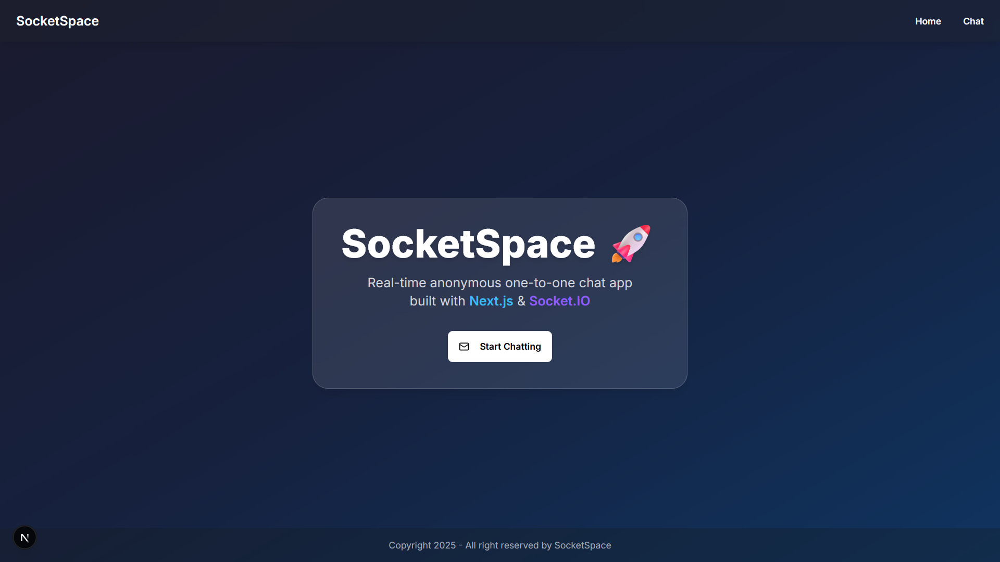
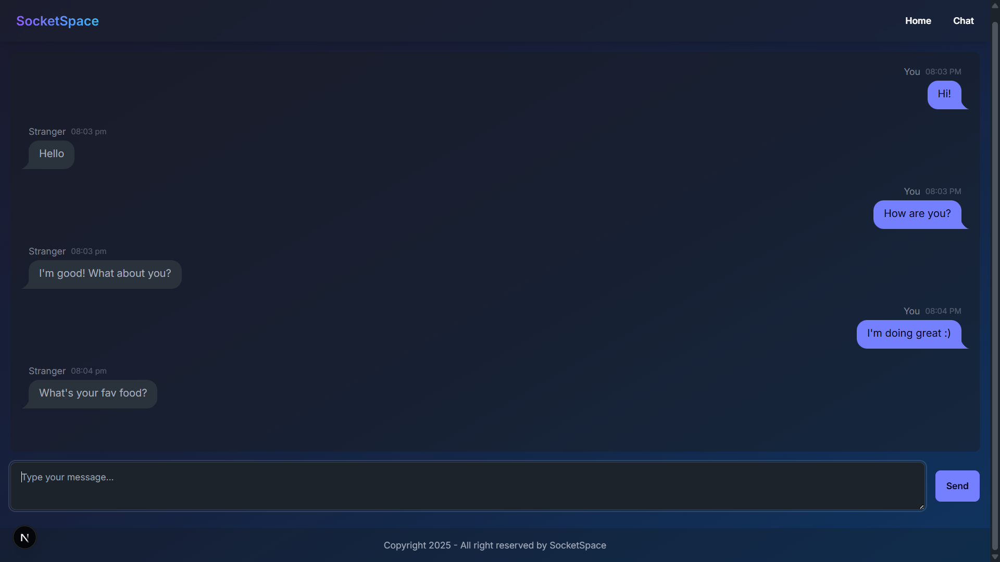
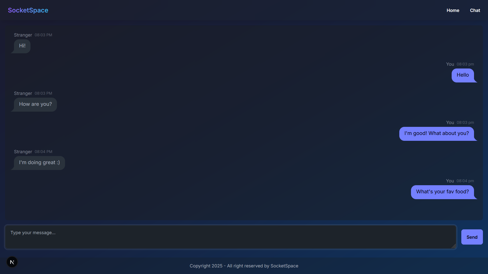

# SocketSpace 🚀

**SocketSpace** is a real-time anonymous 1-on-1 chat web app built with **Next.js 15**, **TypeScript**, **Socket.IO**, and **Express.js**. It allows users to chat instantly in a sleek and minimal UI powered by **Tailwind CSS** and **DaisyUI**. The project is structured for scalability and uses the latest versions of React and Next.js.

---

## ⚡ Features

- 🔒 Anonymous 1-to-1 real-time chat
- 🌙 Always-on dark mode UI
- ⚡ Powered by WebSockets using Socket.IO
- 🧩 Built with modern stack: Next.js 14, TypeScript, Tailwind CSS
- 📦 Lightweight and modular frontend

---

## 🛠️ Tech Stack

| Layer     | Tech                             |
|-----------|----------------------------------|
| Frontend  | Next.js, React, TypeScript       |
| Styling   | Tailwind CSS , DaisyUI           |
| Backend   | Node.js, Express, Socket.IO      |
| Realtime  | WebSocket (Socket.IO)            |

---

## 📁 Project Structure

```

/socketspace
│
└── src/
│   ├── app/
│     ├── chat/
│        └── page.tsx # chat page
│   ├── favicon.ico # Custom app icon
│   ├── globals.css # Tailwind & base styling
│   ├── layout.tsx # Layout of page
│   └── page.tsx # Entry page
│   └── lib/ # Utility and config files
│       └── socket.ts # connectivity
│
├── tailwind.config.js
├── tsconfig.json
├── next.config.js
├── server.js          # Express + Socket.IO server
└── README.md

````

---


## 🚀 Getting Started

### 1. Clone the repository

```bash
git clone https://github.com/jawadm3/SocketSpace.git
cd socketspace
```
### 2. Install dependencies
   
```bash
npm install
```

   Make sure to use compatible versions:

        next@15.4.4

        react@19.1.0

        react-dom@19.1.0

        express@5.1.0

        socket.io@4.8.1

        socket.io-client@4.8.1

### 3. Start the development server
Frontend (Next.js):
```bash
npm run dev
```
### 4. Run the Backend Server

```bash
node server.js
# or
npm run server
```

Make sure `express` and `socket.io` are installed:

```bash
npm install express socket.io
```
Frontend runs at: `http://localhost:3000`
Backend runs at: `http://localhost:8001` *(or the port defined in server.js)*

---

## 🌐 Dependencies

Runtime:

    next@15.4.4

    react@19.1.0

    react-dom@19.1.0

    express@5.1.0

    socket.io@^4.8.1

    socket.io-client@^4.8.1

    cors@^2.8.5

Development:

    typescript@^5

    eslint@^9

    tailwindcss@^3.4.17

    daisyui@^4.12.24

    postcss@^8.5.6

    autoprefixer@^10.4.21

    @types/node, @types/react, @types/react-dom, @types/express, @types/cors
    

---

## 📸 Screenshots

<h3 align="center">Home Page</h3>
<p align="center">
  
</p>

<h3 align="center">Chatting Page (My POV)</h3>
<p align="center">
  
</p>

<h3 align="center">Chatting Page (Strangers POV)</h3>
<p align="center">
  
</p>

---

## 🔧 To Do

* [ ] Add username or emoji-based identity
* [ ] Introduce chat session expiration
* [ ] Add "typing..." indicator
* [ ] Add toast notifications
* [ ] Deploy frontend + backend

---

## 📄 License

This project is open-source and available under the [MIT License](LICENSE).

