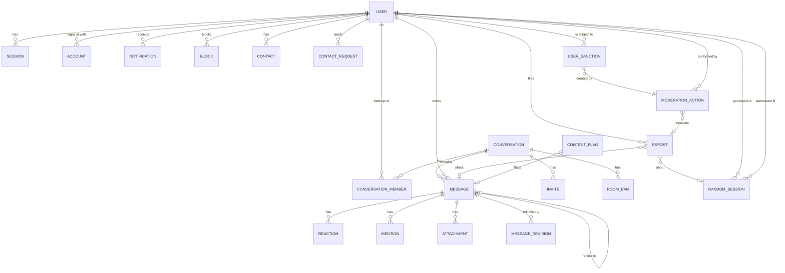

# Data model

_Stage B, 2026-10-01. Proposed for approval. The Drizzle schema in `packages/db` (Stage C) is
built from this document; differences found during implementation are recorded in
`docs/development/decisions.md`._

## Principles

- **One source of truth:** PostgreSQL. Live state (who is online, who is typing, the random-match
  queue) lives only in the realtime server's memory and is never needed to rebuild the database.
- **IDs:** UUID version 7 (time-ordered, so new rows land at the end of indexes). Generated by the
  application. Better Auth is configured to use the same generator.
- **Time:** `timestamptz` (stored in UTC), always set by the server, never by the client.
- **Ordering:** every conversation has its own counter. Each change in a conversation (new
  message, edit, delete, reaction change) takes the next number, called the **event sequence**.
  New messages also keep the number they were created with (`seq`). This makes "what did I miss?"
  a simple question: "give me everything after number N".
- **Idempotency:** a message's `client_id` (generated in the browser) is unique per author. If the
  browser re-sends after a dropped connection, the database returns the already-saved message
  instead of creating a duplicate.
- **Data minimisation:** store only what a feature needs, with a retention period for each kind of
  data (table at the end).

## Entity-relationship diagram (main tables)

## Tables

### Accounts (Better Auth core tables, extended)

**`user`**: one row per person (or per guest, if guest random mode is approved).

| Column                                                                   | Type                                                               | Notes                                                                                          |
| ------------------------------------------------------------------------ | ------------------------------------------------------------------ | ---------------------------------------------------------------------------------------------- |
| `id`                                                                     | uuid (v7)                                                          | Primary key                                                                                    |
| `email`                                                                  | citext, unique                                                     | Case-insensitive. Guests have none.                                                            |
| `email_verified`                                                         | boolean                                                            | Required before posting in community mode                                                      |
| `nickname`                                                               | citext, unique (3 to 24, letters, digits, `_`, `.`, `-`)           | Required. Shown in chats and used for @mentions (D-024)                                        |
| `name`                                                                   | text (up to 60 chars), nullable                                    | Optional **real name** (Better Auth's `name` column; filled from Google/Facebook if available) |
| `real_name_visibility`                                                   | enum `nobody`, `contacts`, `everyone`                              | Default `nobody`                                                                               |
| `name_display`                                                           | enum `nickname`, `real_name`, `both`                               | What chats show; the real name only appears to people allowed to see it. Default `nickname`    |
| `avatar_kind`                                                            | enum `preset`, `custom`, `photo`                                   | Required before onboarding completes (D-023)                                                   |
| `avatar_config`                                                          | jsonb, nullable                                                    | For `preset`/`custom`: DiceBear style, seed and options (CC0 styles only)                      |
| `image`                                                                  | text, nullable                                                     | For `photo`: storage key of the re-encoded image                                               |
| `theme`, `color_mode`                                                    | enum `airmail`, `signal`, `aurora`; enum `system`, `light`, `dark` | Default `airmail` + `system` (D-021)                                                           |
| `onboarded_at`                                                           | timestamptz, nullable                                              | Set once nickname and avatar are chosen; the app redirects to onboarding until then            |
| `bio`                                                                    | text (up to 160 chars)                                             |                                                                                                |
| `role`                                                                   | enum `user`, `admin`                                               | Global role. Room roles are separate.                                                          |
| `status`                                                                 | enum `active`, `suspended`, `banned`, `deleted`                    | Checked on every connect and write                                                             |
| `is_anonymous`                                                           | boolean                                                            | Guest account (random mode only)                                                               |
| `dm_policy`                                                              | enum `everyone`, `contacts`, `nobody`                              | Who may start a DM                                                                             |
| `show_presence`                                                          | boolean                                                            | "Invisible" mode when false                                                                    |
| `read_receipts`                                                          | boolean                                                            | Reciprocal: off means you neither send nor see them                                            |
| `adult_confirmed_at`, `random_terms_version`, `random_terms_accepted_at` | timestamptz, text, timestamptz                                     | 18+ gate record                                                                                |
| `last_seen_at`                                                           | timestamptz                                                        | Rounded to the minute                                                                          |
| `created_at`, `updated_at`, `deleted_at`                                 | timestamptz                                                        |                                                                                                |

**`session`**, **`account`** (password hash or social login), **`verification`** (email and reset
tokens), **`jwks`** (signing keys for realtime tokens): Better Auth's standard tables. Sessions
record IP address and browser name so people can see and end their active sessions in settings.

### Conversations

**`conversation`**: a room or a direct message (DM).

| Column                                    | Type                        | Notes                                                                     |
| ----------------------------------------- | --------------------------- | ------------------------------------------------------------------------- |
| `id`                                      | uuid                        |                                                                           |
| `kind`                                    | enum `room`, `dm`           |                                                                           |
| `visibility`                              | enum `public`, `private`    | DMs are always private                                                    |
| `slug`                                    | citext, unique, nullable    | Rooms only, used in URLs                                                  |
| `name`, `topic`                           | text (up to 50 / 200 chars) | Rooms only                                                                |
| `dm_key`                                  | text, unique, nullable      | DMs only: the two user IDs sorted and joined. Guarantees one DM per pair. |
| `created_by`                              | uuid → user                 |                                                                           |
| `last_event_seq`                          | bigint                      | The per-conversation counter                                              |
| `last_message_at`                         | timestamptz                 | For sorting the sidebar                                                   |
| `member_count`                            | integer                     | Maintained in the same transaction as joins and leaves                    |
| `archived_at`, `created_at`, `updated_at` | timestamptz                 |                                                                           |

**`conversation_member`**: primary key (`conversation_id`, `user_id`).

| Column               | Notes                                                                            |
| -------------------- | -------------------------------------------------------------------------------- |
| `role`               | `owner`, `moderator`, `member`                                                   |
| `last_read_seq`      | Highest message `seq` this member has read: drives unread counts and "Seen"      |
| `last_delivered_seq` | DMs only: highest `seq` a device of this member has received: drives "Delivered" |
| `notify_level`       | `all`, `mentions`, `none`                                                        |
| `muted_until`        | Set by room moderators (cannot post until then)                                  |
| `joined_at`          |                                                                                  |

**`room_ban`**: room-level bans by room owners or moderators (`conversation_id`, `user_id`,
`banned_by`, `reason`, `expires_at`).

**`invite`**: `code_hash` (SHA-256 of a random 128-bit code; the code itself is never stored),
`expires_at`, `max_uses`, `use_count`, `revoked_at`.

### Messages

**`message`**

| Column                     | Type                                    | Notes                                                                                                   |
| -------------------------- | --------------------------------------- | ------------------------------------------------------------------------------------------------------- |
| `id`                       | uuid (v7)                               | Server-generated                                                                                        |
| `conversation_id`          | uuid                                    |                                                                                                         |
| `seq`                      | bigint                                  | Taken from the counter at creation. Unique with `conversation_id`.                                      |
| `version_seq`              | bigint                                  | Counter value of the latest change (edit, delete, reaction). Indexed with `conversation_id` for resync. |
| `author_id`                | uuid → user                             |                                                                                                         |
| `client_id`                | uuid                                    | Unique with `author_id` (idempotency)                                                                   |
| `kind`                     | enum `text`, `system`                   | System: "Alex joined the room"                                                                          |
| `body`                     | text, up to 4,000 characters            | Markdown-lite source text, never HTML                                                                   |
| `body_tsv`                 | tsvector, generated                     | Full-text search (`simple` configuration, language-neutral), GIN index                                  |
| `reply_to_id`              | uuid → message, nullable                | Replies                                                                                                 |
| `edited_at`                | timestamptz                             |                                                                                                         |
| `deleted_at`, `deleted_by` | timestamptz, enum `author`, `moderator` | Deleting clears `body` and keeps a tombstone row so ordering and replies stay consistent                |
| `moderation_state`         | enum `visible`, `flagged`, `removed`    |                                                                                                         |
| `filter_severity`          | smallint                                | Highest word-list severity found (0 to 3)                                                               |
| `created_at`               | timestamptz                             |                                                                                                         |

**How a message gets its number** (one transaction):

1. `UPDATE conversation SET last_event_seq = last_event_seq + 1 ... RETURNING last_event_seq`
   (this row lock also serialises writers in the same conversation, which is fine at our scale).
2. `INSERT INTO message (..., seq, version_seq) SELECT ... WHERE EXISTS (membership)
AND NOT EXISTS (room ban) AND author is active and not muted`. If the `WHERE` fails, nothing is
   written and the sender gets a "not allowed" error: the permission check and the write are
   one step, so a member removed a millisecond earlier cannot slip a message in.
3. `ON CONFLICT (author_id, client_id) DO NOTHING`, then return the existing row if there was one.

**`message_revision`**: previous bodies after edits (`message_id`, `revision`, `body`,
`created_at`). Kept 30 days so moderators can see what a reported message said before it was edited.

**`reaction`**: primary key (`message_id`, `user_id`, `emoji`). `emoji` must be in an allow-list
(prevents arbitrary strings).

**`mention`**: (`message_id`, `user_id`). Parsed on the server from `@nickname` tokens.

**`attachment`**: `uploader_id`, `message_id` (null until the message is sent), `storage_key`,
`thumb_key`, `mime` (always `image/webp` after re-encoding), `width`, `height`, `bytes`, `sha256`,
`status` (`pending`, `attached`, `removed`). Pending uploads older than 24 hours are deleted.
A profile photo is an attached row with no message; the profile's `avatar_config` holds its ID.
`thumb_key` is unused: one file per picture is stored (D-043).

**`link_preview`**: cache keyed by a hash of the normalised URL: `title`, `description`,
`site_name`, `status` (`ok`, `blocked`, `error`), `fetched_at`, `expires_at` (7 days).
**`message_link`** joins messages to previews.

### Social

- **`block`**: (`blocker_id`, `blocked_id`). Checked when starting DMs, sending DMs, matching in
  random mode, and mentioning.
- **`contact`**: stored in both directions (`user_id`, `contact_id`, `source` = `manual` or
  `random`).
- **`contact_request`**: `from_id`, `to_id`, `status` (`pending`, `accepted`, `declined`,
  `cancelled`), `source`.
- **`notification`**: `user_id`, `type` (`mention`, `reply`, `dm`, `invite`, `contact_request`,
  `moderation`), `conversation_id`, `message_id`, `actor_id`, `created_at`, `read_at`.

### Random mode

- **`random_session`**: `id`, `started_at`, `ended_at`, `end_reason` (`skip`, `end`,
  `disconnect`, `report`, `filter`, `timeout`), `participant_a`, `participant_b`,
  `shared_interest_count`. **No message text is ever stored here.**
- The live queue, the pairing and the last 20 messages of each live session (the "evidence
  buffer") exist **only in the realtime server's memory**. If someone reports within 5 minutes of
  the session ending, the server copies that buffer into the report; otherwise it is discarded.

### Trust and safety

- **`report`**: `reporter_id`, `target_type` (`message`, `user`, `room`, `random_session`),
  `target_user_id`, `message_id`, `conversation_id`, `random_session_id`, `reason` (`spam`,
  `harassment`, `hate`, `sexual`, `self_harm`, `violence`, `illegal`, `underage`, `other`),
  `details` (up to 1,000 characters), `evidence` (JSON snapshot taken **by the server**, not
  supplied by the reporter), `status` (`open`, `in_review`, `actioned`, `dismissed`),
  `assigned_to`, `resolution_note`, `created_at`, `resolved_at`.
- **`content_flag`**: automatic flags from the word list or AI: `source`, `severity` (`low`,
  `medium`, `high`), `categories`, `message_id` or `random_session_id`, `excerpt` (the flagged
  message only), `user_id`, `reviewed_by`, `reviewed_at`, `outcome`.
- **`moderation_action`**: the audit log. `actor_id`, `action` (`warn`, `mute`, `unmute`,
  `suspend`, `unsuspend`, `ban`, `unban`, `remove_message`, `restore_message`, `resolve_report`,
  `dismiss_report`, `role_change`, `room_ban`), `target_user_id`, `message_id`, `report_id`,
  `conversation_id`, `reason` (required), `expires_at`, `metadata`, `created_at`.
  **Append-only:** a database trigger rejects `UPDATE` and `DELETE` on this table.
- **`user_sanction`**: active penalties for fast checks: `kind` (`warn`, `mute`, `suspend`, `ban`,
  `random_timeout`), `scope` (`global`, `random`), `reason`, `action_id`, `starts_at`,
  `expires_at` (null = permanent), `lifted_at`.
- **`network_ban`**: `ip_hash` (HMAC of the IP address with a secret key, so raw IPs are never
  stored), `reason`, `expires_at` (at most 90 days). Used for guests and repeat offenders.

### Operations

- **`http_rate_limit`**: fixed-window counters for HTTP routes on Vercel (`key`, `window_start`,
  `count`). Better Auth uses its own rate-limit table for auth routes.
- **`realtime_outbox`**: internal events (for example "user banned") that could not be delivered
  to the realtime server immediately. Drained when the realtime server starts, and opportunistically
  (at most every 10 seconds) while it is already handling database work. **Never on an idle timer**,
  so idle connections do not keep the database awake (see the Neon maths in the research doc).
- **`metric_daily`**: privacy-respecting aggregate counts only (`day`, `name`, `value`), for example
  `random_sessions_started`, `random_mutual_contact_added`, `random_room_cta_clicked`,
  `room_joined_after_random`. No user IDs.

## Retention

A daily scheduled job (Vercel Cron on the Hobby plan, once a day) deletes or clears data that has
passed its retention period.

| Data                                     | Kept for                                                                          | Why                                        |
| ---------------------------------------- | --------------------------------------------------------------------------------- | ------------------------------------------ |
| Community messages                       | Until deleted by the author or a moderator, or the account is deleted (see below) | The product is a persistent chat           |
| Body of a message removed by a moderator | 30 days, then cleared                                                             | Appeals and review                         |
| `message_revision` (edit history)        | 30 days                                                                           | Moderation of edited messages              |
| Random-mode message text                 | **Never stored.** In memory only during the session plus 5 minutes                | Ephemeral by design                        |
| `random_session` metadata                | 30 days                                                                           | Safety: linking reports and repeated abuse |
| Reports and their evidence               | 180 days after resolution                                                         | Repeat-offender patterns, appeals          |
| `content_flag`                           | 90 days                                                                           | Review queue                               |
| `moderation_action` (audit log)          | 1 year                                                                            | Accountability of moderators               |
| `notification`                           | 90 days                                                                           | Nobody needs older ones                    |
| Sessions (with IP and browser)           | Until expiry (30 days) or sign-out                                                | Security: "active sessions" list           |
| `network_ban`                            | Until the ban expires (maximum 90 days)                                           |                                            |
| `link_preview` cache                     | 7 days                                                                            |                                            |
| Pending (unsent) uploads                 | 24 hours                                                                          |                                            |
| `metric_daily`                           | Indefinitely                                                                      | Aggregates only, no personal data          |

**Account deletion:** the profile, sessions, contacts, blocks, notifications and uploads are
deleted. Messages in rooms and DMs stay as "Deleted user" **unless** the person ticks "also delete
everything I wrote", in which case their message bodies are cleared too. Reports _about_ a deleted
user keep their evidence until the report's retention ends (legitimate interest in safety; stated in
the Privacy Policy). Deletion requires re-entering the password (or re-authenticating with GitHub).

**Data export:** a JSON file with the person's profile, memberships, their own messages,
reactions, contacts, blocks and reports they filed. Limited to once per day.
