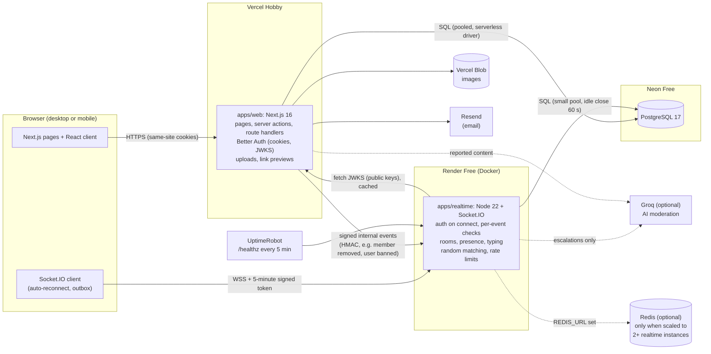

# System overview

_Stage B, 2026-10-01. Proposed for approval._

## The big picture in plain English

SocketSpace has two programs that run all the time, one database, and a few helper services.

- The **web app** (Next.js on Vercel) is what people open in their browser. It shows the pages,
  handles sign-up and sign-in, and does everything that is a normal "ask and answer" request:
  loading message history, creating rooms, uploading images, filing reports, moderation actions.
- The **realtime server** (Node.js + Socket.IO on Render) keeps a live connection open to every
  browser. It receives new messages, checks them, saves them, and pushes them instantly to the
  right people. It also runs presence ("online"), typing indicators and random matching.
- The **database** (PostgreSQL on Neon) is the single source of truth. Both programs read and write
  it through the same shared code (`packages/db`).

Think of a restaurant: the web app is the front of house (menus, bookings, payments), the realtime
server is the kitchen pass where dishes go out the moment they are ready, and the database is the
order book both of them write in.

## System diagram



## Who does what

| Concern                                                                        | Web app (Vercel)                             | Realtime server (Render)                          |
| ------------------------------------------------------------------------------ | -------------------------------------------- | ------------------------------------------------- |
| Sign-up, sign-in, sessions, email verification, password reset, social sign-in | Yes (Better Auth)                            | No: trusts signed tokens from the web app         |
| Issue realtime connection tokens (5 min, signed)                               | Yes                                          | Verifies them                                     |
| Send / edit / delete messages, reactions                                       | No (so there is one writer and one ordering) | Yes                                               |
| Load message history (pages), search                                           | Yes (server components, route handlers)      | Resync of recent missed events only               |
| Create rooms, invites, roles, join/leave                                       | Yes, then sends an internal event            | Applies membership changes to live connections    |
| Presence, typing, read receipts, unread counts                                 | Reads counts for page loads                  | Live updates                                      |
| Random matching, random chat                                                   | Gate pages (18+, terms)                      | Queue, matching, relay, in-memory evidence buffer |
| Uploads (validate, re-encode, store)                                           | Yes                                          | Receives attachment IDs with messages             |
| Link previews (server-side, SSRF-safe)                                         | Yes                                          | No                                                |
| Reports, moderation dashboard, sanctions                                       | Yes, then sends an internal event            | Enforces sanctions live (disconnect, mute)        |
| Notifications                                                                  | Stores and lists them                        | Pushes new ones live                              |

**Why messages go through the realtime server, not the web app:** one program assigns every
message its order number inside a database transaction and pushes it out immediately. If both
programs could write messages, the realtime server would have to learn about web-app writes
somehow, and ordering would be harder to guarantee.

## Deployment topology and configuration

| Piece           | Where                                              | Address (example)                            |
| --------------- | -------------------------------------------------- | -------------------------------------------- |
| Web app         | Vercel project, root directory `apps/web`          | `https://socketspace.vercel.app`             |
| Realtime server | Render web service from `apps/realtime/Dockerfile` | `https://socketspace-rt.onrender.com` (WSS)  |
| Database        | Neon project, Postgres 17                          | pooled and direct connection strings         |
| Images          | Vercel Blob store (private access)                 | not public: served through `/api/media/<id>` |

All addresses, origins and secrets come from environment variables, validated at start-up with
Zod; a missing or malformed variable stops the program with a message naming the variable (never
its value). The full list, with descriptions and no values, will live in `.env.example`
(Stage C). Main names:

| Variable                                                                                          | Used by  | Purpose                                                    |
| ------------------------------------------------------------------------------------------------- | -------- | ---------------------------------------------------------- |
| `DATABASE_URL`, `DATABASE_URL_DIRECT`                                                             | both     | Pooled connection (app) and direct connection (migrations) |
| `BETTER_AUTH_SECRET`, `BETTER_AUTH_URL`                                                           | web      | Session signing and the public URL of the web app          |
| `REALTIME_PUBLIC_URL`                                                                             | web      | Where browsers connect for live updates                    |
| `WEB_ORIGINS`                                                                                     | realtime | Allow-list of browser origins for the WebSocket handshake  |
| `AUTH_JWKS_URL`, `AUTH_ISSUER`, `REALTIME_TOKEN_AUDIENCE`                                         | realtime | How to verify connection tokens                            |
| `INTERNAL_EVENTS_SECRET`, `REALTIME_INTERNAL_URL`                                                 | both     | Signing key and address for web → realtime events          |
| `RESEND_API_KEY`, `EMAIL_FROM`, `SMTP_URL`                                                        | web      | Email (one of the two providers)                           |
| `BLOB_READ_WRITE_TOKEN`, `STORAGE_DRIVER`                                                         | web      | Image storage                                              |
| `GITHUB_CLIENT_ID/SECRET`, `GOOGLE_CLIENT_ID/SECRET`                                              | web      | Optional social sign-in                                    |
| `AI_MODERATION_ENABLED`, `AI_MODERATION_BASE_URL`, `AI_MODERATION_API_KEY`, `AI_MODERATION_MODEL` | both     | Optional AI moderation (off by default)                    |
| `REDIS_URL`                                                                                       | realtime | Optional: switches on multi-instance fan-out               |
| `SENTRY_DSN`                                                                                      | both     | Optional error tracking                                    |
| `METRICS_TOKEN`                                                                                   | realtime | Protects `/metrics`                                        |

## Repository layout (target)

```
apps/
  web/                Next.js app
    src/app/            routes: (marketing), (auth), (app), admin, api
    src/features/       chat, rooms, random, moderation, settings (UI + server actions)
    src/server/         auth setup, realtime token issuer, internal-event sender, uploads, previews
  realtime/           Socket.IO server
    src/server.ts       HTTP + Socket.IO bootstrap, graceful shutdown
    src/auth/           token verification, origin check
    src/handlers/       one file per event group: messages, reactions, typing, presence, sync, random
    src/random/         queue and matcher, evidence buffer
    src/limits/         token-bucket rate limiters, connection caps
    Dockerfile
packages/
  shared/             Zod schemas for every event and payload, error codes, markdown-lite parser,
                      word-list filter, constants (limits)
  db/                 Drizzle schema, migrations, query functions (used by both apps), seed
  ui/                 design tokens, Tailwind preset, accessible components
  config/             tsconfig, ESLint and Tailwind presets
  moderation/         (may live in shared) word list, normaliser, AI provider interface + Groq + mock
tests/
  e2e/                Playwright suites (two-browser chat, reconnect, moderation)
  load/               load-test harness and scenarios
```

## Scaling path (beyond the free tier)

1. **Vertical:** a bigger Render instance (more CPU) is the first step: no code change.
2. **Horizontal:** run 2+ realtime instances behind a load balancer with sticky sessions (needed
   for Socket.IO's long-polling fallback) and set `REDIS_URL`. The Redis adapter fans messages out
   across instances; rate limiters and presence move to Redis through the same interfaces. This
   path is exercised in CI.
3. **Database:** Neon paid tiers (more compute), then read replicas for history and search.

## Failure behaviour (what users see)

| Failure                             | Behaviour                                                                                                                                                          |
| ----------------------------------- | ------------------------------------------------------------------------------------------------------------------------------------------------------------------ |
| Realtime server asleep (cold start) | Banner "Connecting to the chat server... this can take up to a minute on our free hosting." History still loads from the web app.                                  |
| Realtime server restarts            | Clients reconnect with back-off, resync missed messages by sequence number, re-send unacknowledged messages from the outbox (no duplicates, thanks to client IDs). |
| Database waking up                  | First query takes a few hundred milliseconds longer; nothing else.                                                                                                 |
| Database unavailable                | Realtime acknowledgements return a retryable error; messages stay in the outbox; banner explains.                                                                  |
| Image quota reached                 | Upload button disabled with an explanation; text chat unaffected.                                                                                                  |
| AI provider down or rate-limited    | Silent fallback to the word-list filter; logged as a metric.                                                                                                       |
| Email quota reached                 | Sign-up still succeeds; verification email queued; GitHub sign-in suggested.                                                                                       |
