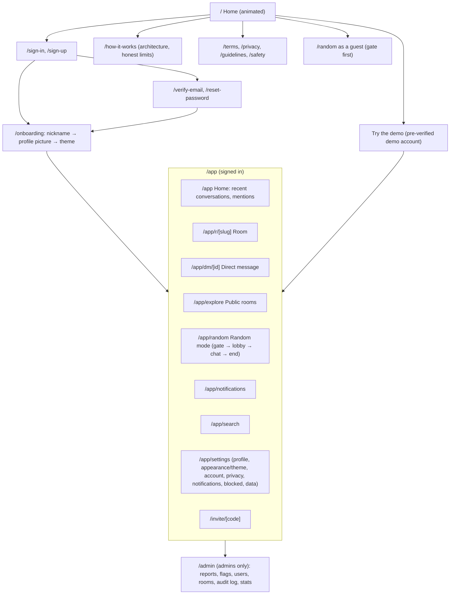
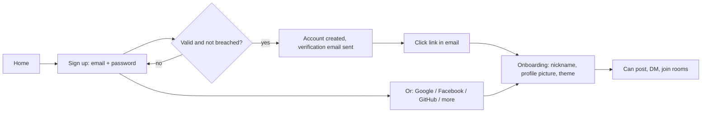

# Product design: screens and flows

_Stage B, 2026-10-01. Proposed for approval._

## Who it is for

| Person                           | What they want                                          | What SocketSpace offers                                                 |
| -------------------------------- | ------------------------------------------------------- | ----------------------------------------------------------------------- |
| **Community member** (main user) | Hang out in topic rooms and talk privately with friends | Rooms, DMs, rich messages, presence, history, search                    |
| **Curious newcomer**             | Try chatting with someone new without commitment        | Random mode as a low-pressure entry point, with a path into rooms       |
| **Room owner / moderator**       | Keep their room friendly                                | Roles, invites, mutes, room bans, room word list                        |
| **Platform admin**               | Keep everyone safe                                      | Reports and flags queue, sanctions, audit log, aggregate stats          |
| **Portfolio visitor**            | See what the developer built, in 2 minutes              | Animated home page, one-click demo accounts, honest "how it works" page |

## Information architecture



## The app shell (desktop, 1280 px and wider)

```
┌────┬──────────────────┬───────────────────────────────────────┬──────────────┐
│Rail│ Sidebar          │ Conversation                          │ Details      │
│    │                  │ ┌───────────────────────────────────┐ │ (toggle)     │
│ ⌂  │ Search… (Ctrl K) │ │ # design-talk · 24 online   ⋯     │ │ Members      │
│ #  │ ROOMS            │ ├───────────────────────────────────┤ │ Pinned       │
│ @  │  # general    3  │ │ ── New messages ──                │ │ Files        │
│ 🎲 │  # design-talk   │ │ Ava  10:41                        │ │              │
│ 🔔 │ DIRECT MESSAGES  │ │  Has anyone tried the new ...     │ │              │
│    │  ● Sam        1  │ │  ↳ reply · 😀 3 · 👍 1            │ │              │
│ ⚙  │  ○ Lee           │ │ Sam is typing…                    │ │              │
│ me │                  │ ├───────────────────────────────────┤ │              │
│    │ + New room       │ │ [+] Message #design-talk   😊 ⏎  │ │              │
└────┴──────────────────┴───────────────────────────────────────┴──────────────┘
```

- **Rail:** Home, Rooms, DMs, Random, Notifications, Settings, avatar menu (status, theme, sign out).
- **Sidebar:** quick switcher (Ctrl/Cmd + K), rooms and DMs with unread badges and presence dots.
- **Conversation:** header (name, topic, online count, actions), virtualised message list,
  composer (markdown-lite, emoji picker, image attach, reply chip, @mention autocomplete).
- **Details panel:** members with roles and presence, room info, shared images.
- **Tablet (768 to 1279 px):** rail + one column; the details panel opens as a sheet.
- **Mobile (below 768 px):** bottom tab bar (Chats, Explore, Random, Activity, Me); conversation
  list and conversation are separate screens; the composer stays above the keyboard
  (`100dvh` and `visualViewport`, fixing v1's fixed-height layout).

## Screen inventory

Every screen has designed **empty**, **loading** (skeletons, not spinners) and **error** states.

| Screen               | Purpose and key elements                                                                                                                                                                                                                                                                                                            | Empty / loading / error                                                                         |
| -------------------- | ----------------------------------------------------------------------------------------------------------------------------------------------------------------------------------------------------------------------------------------------------------------------------------------------------------------------------------- | ----------------------------------------------------------------------------------------------- |
| Home (marketing)     | Animated hero (follows the chosen theme; Airmail by default), theme switcher in the header, value statement, "Try the demo", "Sign up", feature sections with scroll animations, safety section, honest free-tier note, footer                                                                                                      | Reduced-motion and no-WebGL/Canvas fallback: a static illustration                              |
| How it works         | Architecture diagram, v1 vs v2, limits                                                                                                                                                                                                                                                                                              | n/a                                                                                             |
| Sign up / sign in    | Google (large), Facebook and GitHub first; "More ways to sign in" (Discord, Microsoft, LinkedIn, passkey); email + password; "Last used" badge; links to terms                                                                                                                                                                      | Field-level errors; rate-limit message with wait time                                           |
| Verify email / reset | Clear steps, resend with cooldown                                                                                                                                                                                                                                                                                                   | Expired link screen with a "send a new one" button                                              |
| Onboarding           | Three steps: nickname and optional real name (with visibility and display choices), profile picture (presets, customiser, photo upload), theme                                                                                                                                                                                      | Nickname taken: suggestions; upload refused: reason; cannot finish without nickname and picture |
| App home             | Recent conversations, unread mentions, suggested public rooms                                                                                                                                                                                                                                                                       | New user: three suggested rooms and "Try random mode"                                           |
| Room                 | Header, messages, composer, members panel                                                                                                                                                                                                                                                                                           | "Be the first to say hello"; history skeletons; "Couldn't load messages. Retry"                 |
| DM                   | Same as room plus delivery/seen ticks and the person's presence                                                                                                                                                                                                                                                                     | "Say hi to Sam"; blocked: "You can't message this person"                                       |
| Explore              | Searchable directory of public rooms (name, topic, member count, activity)                                                                                                                                                                                                                                                          | "No rooms match. Create one?"                                                                   |
| Create room          | Name, slug preview, topic, public/private                                                                                                                                                                                                                                                                                           | Inline validation                                                                               |
| Room settings        | Members with roles, invites (create, copy, revoke, expiry, uses), room word list, delete                                                                                                                                                                                                                                            | Owner-only actions hidden and refused server-side                                               |
| Invite               | Room preview and "Join"                                                                                                                                                                                                                                                                                                             | Expired, revoked or used-up invite states                                                       |
| Random: gate         | Plain-language rules, 18+ confirmation, terms checkbox                                                                                                                                                                                                                                                                              | Shown again when the rules version changes                                                      |
| Random: lobby        | Interest tags input, "Start", tips                                                                                                                                                                                                                                                                                                  | Sanction state: "Random mode is paused for you until 14:20 because..."                          |
| Random: searching    | Calm animation, time waited, "Cancel"                                                                                                                                                                                                                                                                                               | After 10 s: "Widening the search to everyone"                                                   |
| Random: chat         | Stranger label, shared interests, messages, Skip/Next, End, Report, Block, "Share profile" and "Add contact" (both must accept)                                                                                                                                                                                                     | Partner disconnected: "Stranger left"                                                           |
| Random: ended        | Summary, "Next", "Add contact" (if mutual), **suggested rooms for your shared interests**                                                                                                                                                                                                                                           | n/a                                                                                             |
| Notifications        | Mentions, replies, DMs, invites, contact requests, moderation notices                                                                                                                                                                                                                                                               | "You're all caught up"                                                                          |
| Search               | Query, filters (conversation, person, date), results with highlighted terms, jump to message                                                                                                                                                                                                                                        | "No results for..." with tips                                                                   |
| Settings             | Profile (nickname, optional real name with visibility and display choice, avatar, bio), appearance (theme and mode), account (email, password, sessions, linked sign-in methods), privacy (DM policy, presence, read receipts), notifications (in-app, browser), blocked people, theme, **download my data**, **delete my account** | Confirmations for destructive actions                                                           |
| Profile popover      | Avatar, nickname (and real name if allowed), bio, presence, "Message", "Block", "Report"                                                                                                                                                                                                                                            | Blocked/deleted states                                                                          |
| Admin: reports       | Queue with filters, report detail with evidence snapshot and context, actions with required reason                                                                                                                                                                                                                                  | "No open reports"                                                                               |
| Admin: flags         | Automatic flags by severity and source                                                                                                                                                                                                                                                                                              | "Nothing flagged"                                                                               |
| Admin: users         | Search, user detail (sanctions history, reports), actions                                                                                                                                                                                                                                                                           |                                                                                                 |
| Admin: audit log     | Filterable, read-only list of every moderator action                                                                                                                                                                                                                                                                                |                                                                                                 |
| Admin: stats         | Live connections, messages per minute, random funnel counts (aggregates only), free-tier usage                                                                                                                                                                                                                                      |                                                                                                 |
| 404 / 500 / offline  | Friendly, with a way home; offline banner in the app shell                                                                                                                                                                                                                                                                          |                                                                                                 |

## Key flows

### Sign up and verify



### Sign-in screen (D-022)

```
┌──────────────────────────────────────────┐
│          Welcome to SocketSpace          │
│  [ G  Continue with Google        ] Last used
│  [ f  Facebook ]  [ ⌥  GitHub    ]       │
│  More ways to sign in ▾                  │
│     (Discord · Microsoft · LinkedIn ·    │
│      Sign in with a passkey)             │
│  ─────────────── or ───────────────      │
│  Email     [                        ]    │
│  Password  [                        ]    │
│  [           Sign in               ]     │
│  Forgot password? · Create account       │
└──────────────────────────────────────────┘
```

- Only providers configured on the server are shown. The "Last used" badge comes from this
  device's previous sign-in.
- Apple is not offered (its developer programme is paid); X can be added later.

### Onboarding (D-023, D-024, D-021)

Three short steps, with a progress indicator. The first two cannot be skipped.

1. **Your name.** Nickname (required, unique, suggestions shown if taken). Real name (optional,
   pre-filled from Google or Facebook if available). Two choices with plain explanations: "Who can
   see your real name?" (nobody, contacts, everyone; default nobody) and "What should chats show?"
   (nickname, real name, both; default nickname).
2. **Your picture.** A gallery of about 24 illustrated avatars (shuffle for more), a **Customise**
   tab with an avatar builder (face, hair, accessories, background colour, with a live preview),
   and an **Upload a photo** tab. One must be chosen to continue.
3. **Your look.** The three themes as preview cards (Airmail, Signal, Aurora), each with light,
   dark and "match my device". Airmail is pre-selected. Can be changed any time in Settings >
   Appearance.

### Theme section (D-021)

- **Settings > Appearance:** the same three preview cards and mode switch as onboarding, with a live
  preview of a chat.
- **Home page header:** a compact theme switcher; the hero animation changes with the theme.
- **Signed-out visitors:** the choice is remembered on that device; it is copied to the account
  when they sign up.

### Sending a message (optimistic)

1. Press Enter. The message appears instantly, slightly faded, with a clock icon.
2. The server confirms within milliseconds: it becomes solid with one tick.
3. If the connection is down, it stays in the outbox and a banner says "Offline: messages will be
   sent when you reconnect". On reconnect it is sent automatically (no duplicates).
4. If refused (for example muted), it turns red with the reason and a "Delete" option.

### Random mode to community (the retention path)

The brief notes that random-chat products lose people once the novelty fades. Random mode is
therefore designed as a door into the community, measured with aggregate counts only:

1. **End screen suggests rooms** that match the interests both people shared ("You both like chess:
   join #chess (128 members)"). Counter: `random_room_cta_clicked`.
2. **Mutual "Add contact"** turns a good conversation into a DM thread. Counter:
   `random_mutual_contact_added`.
3. **Guests** (approved, D-025) are invited to create an account to keep the contact. Counter:
   `random_guest_signed_up`.
4. Admin stats show the funnel: sessions started → matched → mutual contacts → room joins.

### Report and moderation

See the sequence diagram in `docs/architecture/realtime-protocol.md`. User-facing: one tap opens a
short form (reason + optional details); the reporter gets a confirmation and later a "resolved"
notification. The reported person sees a clear notice with the reason if action is taken.

## Interaction and accessibility rules

- **Keyboard first:** everything reachable by keyboard; visible focus rings; `Ctrl/Cmd + K`
  switcher; `Esc` closes overlays and returns focus to where it was; arrow keys move through the
  message list; `Up` in an empty composer edits your last message.
- **Screen readers:** the message list is a `log` region; new messages are announced politely
  (batched, at most one announcement per 2 seconds, never while the user is typing); every icon
  button has a label; unread counts are spoken ("3 unread").
- **No forced scrolling:** new messages auto-scroll only if you are already at the bottom;
  otherwise a "New messages ↓" pill appears (fixes v1's behaviour).
- **Motion:** 150 to 250 ms in the app; everything respects `prefers-reduced-motion`.
- **Contrast:** text at least 4.5:1 (normal) and 3:1 (large and UI parts) in both themes; checked
  automatically with axe in end-to-end tests.
- **Touch targets** at least 44 × 44 px on mobile.

## Decisions recorded (owner, 2026-10-01)

1. **Guests in random mode:** yes, with an anonymous session and stricter limits (D-025).
2. **Threads:** inline replies (quote + jump to original) for v2; side-panel threads are a future
   improvement (D-018).
3. **Names:** unique nickname in chats; optional real name, private by default (D-024).
4. **Profile pictures:** required during onboarding (D-023).
5. **Themes:** Airmail (default), Signal and Aurora, each light or dark (D-021).
6. **Sign-in options:** Google, Facebook, GitHub first; more under a toggle (D-022).
